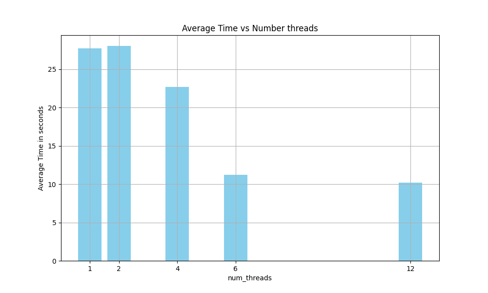
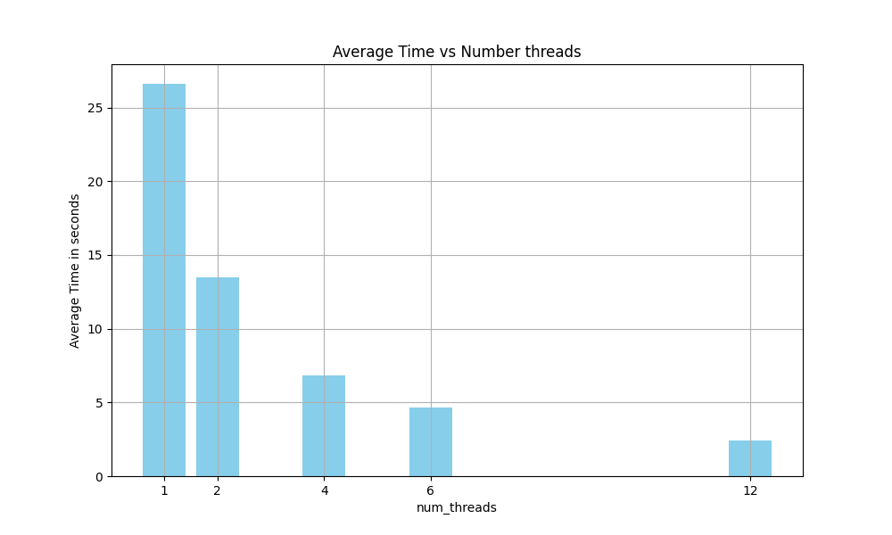

# Report Exercise Sheet 05
Report by Marco Fröhlich, Johanna Backer and Camillo Zanolin

## Exercise 1
### Task 1 Performance Issues
- Unefficient to do the summation of matrix c in two steps when it could be done in one step with a reduction.
- In our opinion the code contains a flaw because the matrix multiplication $a\cdot b$ is done without proper synchronisation resulting in random 
    results eventough the same seed for the srand() is used.

### Task 2 Improvements
- Introduction of atomic statement for each cell in matrix c during matrix multiplication to introduce synchronisation.
- Introduction of a collapse statement for the matrix multiplication.
- Reduction for summation of matrix c in one step.

### Task 3 Benchmarks
Both benchmarks were done on the LCC3 cluster, doing 10 iteration for each threads $[1,2,4,6,12]$. Both files were compiled with optimization flag -O3. 
Our optimized implementation was significantly faster for more involved threads.

#### Original Code

#### Optimazied Code
