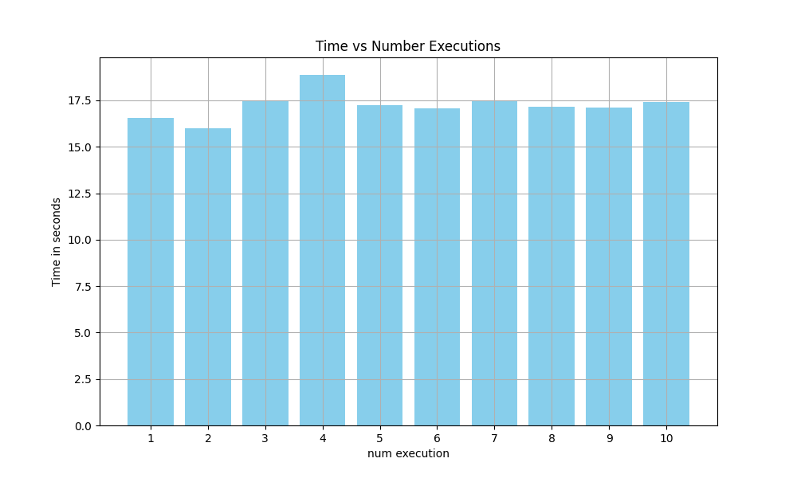
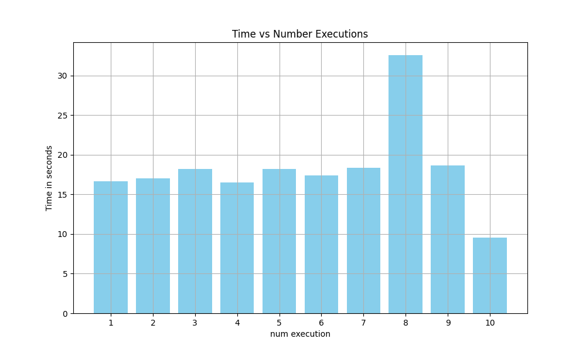
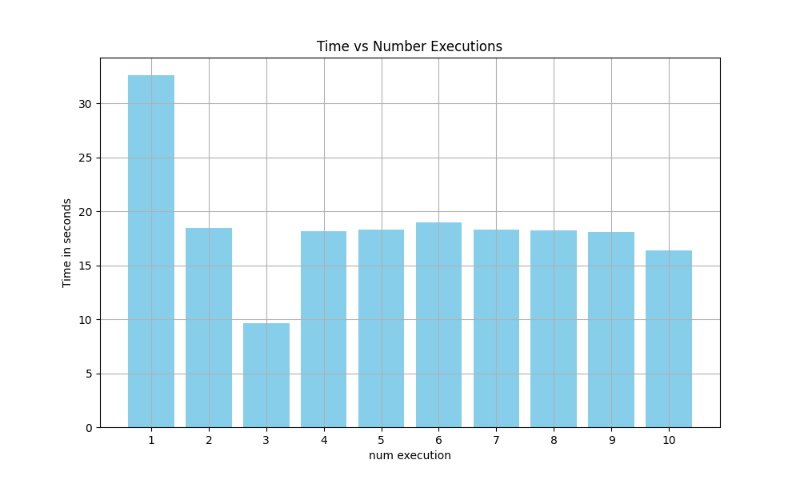
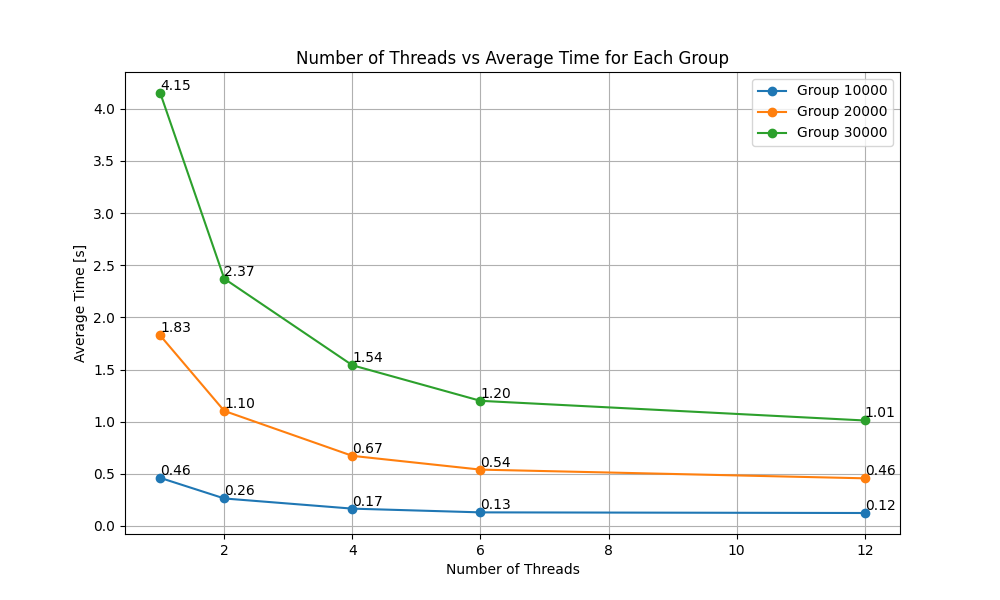
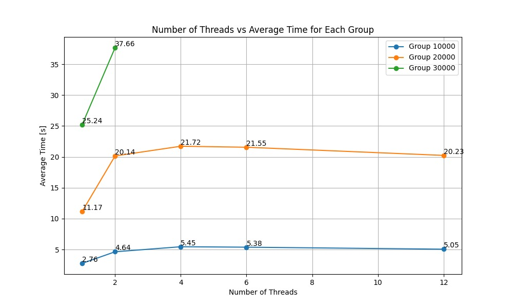

# Exercise Sheet 08
Solution by Johanna Backer, Camillo Zanolin and Marco Fröhlich.

## Task 1
**Benchmarks:**\
Each variant of the program had 500000000 iterations and executed 10 times.

#### Master

#### Spread

#### Close

### Findings
The variant with the master affinity setting was the most consistent one. Spread and Close one had both outliners up and downwards. On average the fastest variant used the master affinity setting with 17.233 seconds.

## Task 2

### Benchmark Serial vs. Parallel version
Each version was benchmarked on the LCC3 cluster using 10 iterations per number of threads $\{1,2,4,6,12\}$ and array matrix $\{10000^2, 20000^2, 30000^2\}$.

**Parallel version:**

**Serial version:**\
The serial version had the following results:

| matrix size | time (s) |
| ----------- | -------- |
| 10000       | 0.41     |
| 20000       | 1.71     |
| 30000       | 3.78     |

### Static, Guided, Dynamic scheduling
Each version was benchmarked on the LCC3 cluster using 10 iterations per number of threads $\{1,2,4,6,12\}$ and array matrix $\{10000^2, 20000^2, 30000^2\}$.\
\
**static scheduling:**
\
**guided scheduling:**
\
**dynamic scheduling:**
\
The dynamic version was not finished with all 150 versions, due to the time limit for computation on the LCC3.\
\
The static and guided scheduling version took nearly the same amount of time. For the matrix size $3000^2$, these implementations took surprisingly the same amount of time.
The dynamic version took way more time.
