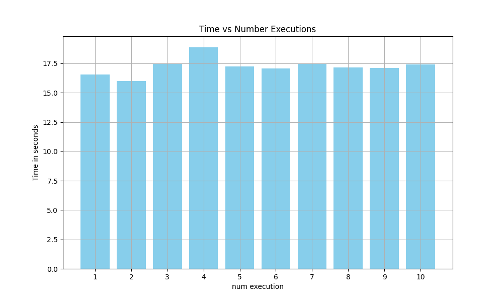
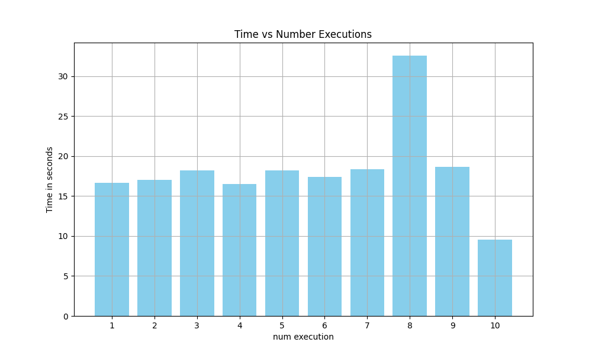
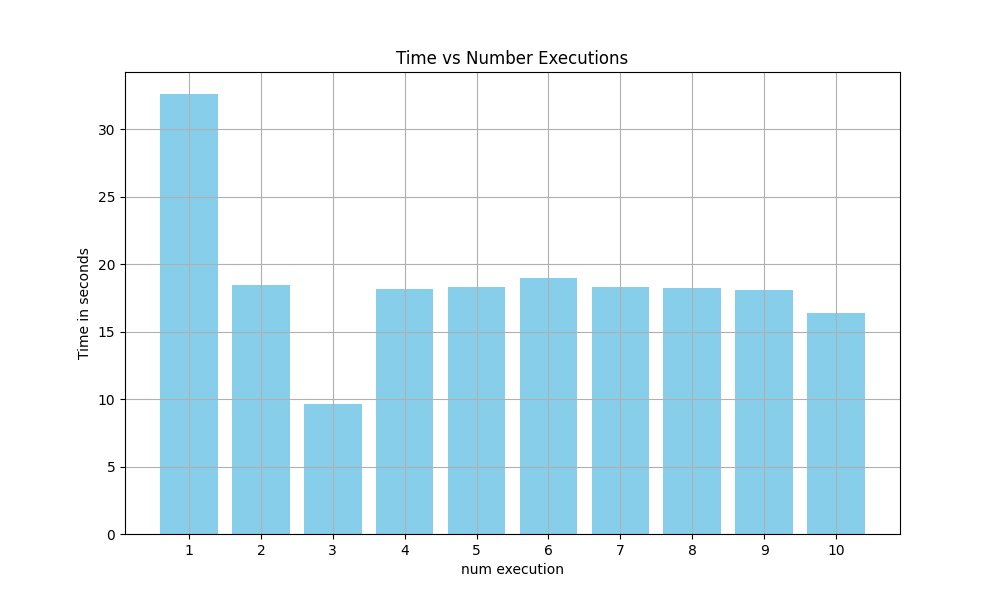

# Exercise Sheet 08
Solution by Johanna Backer, Camillo Zanolin and Marco Fröhlich.

## Task 1
**Benchmarks:**\
Each variant of the program had 500000000 iterations and executed 10 times.

#### Master

#### Spread

#### Close

### Findings
The variant with the master affinity setting was the most consistent one. Spread and Close one had both outliners up and downwards. On average the fastest variant used the master affinity setting with 17.233 seconds.

## Task 2

#### Static scheduling 

It will divide the iterations into chunks of the specified size with one iteration containing the remainder if the iter_number is not dividable by the size.
It will be distributed evenly on all available threads in order. 
(The default chunk size is 1 if not specified.)

### Dynamic scheduling
Divides the iteration into chunks of size chunks size in the same way. But the distribution is not in order and one thread may take more. It is useful 
if some iterations are computationally heavier than others. 
In contrast to static scheduling, it has more overhead.

### Guided scheduling
It divides the unassigned iterations to all threads and then reduces the size to chunk size. 
