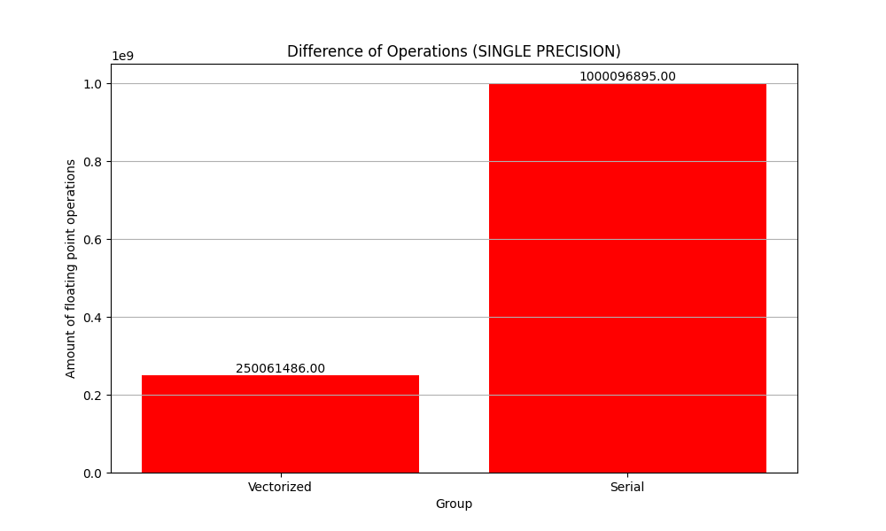

# Exercise Sheet 08
Solution by Johanna Backer, Camillo Zanolin and Marco Fröhlich.

## Task 1

### Findings

After vectorization the computation stays as correct as the serial implementation in our case. Overflow seems to happen due to the limitations of the third matrix to also be a float instead of a bigger datatype like double. 
Regarding the perf outputs the `FP_COMP_OPS_EXE.SSE_SINGLE_PRECISION` seems adequate to meassure the difference. The vectorized version has just a quarter of the operations performed. 

All the other perform rather similarly or just don't have much computational load like `FP_COMP_OPS_EXE.SSE_DOUBLE_PRECISION` with 10 (serial) and 9 (vectorized) computations respectively. 

